## 第2篇 再探设计模式

### 第二章 命令模式
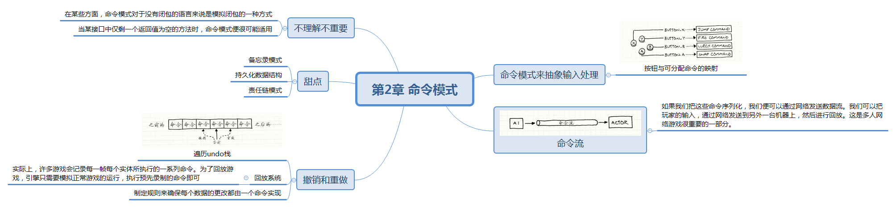 

### 第三章 享元模式

### 第四章 观察者模式
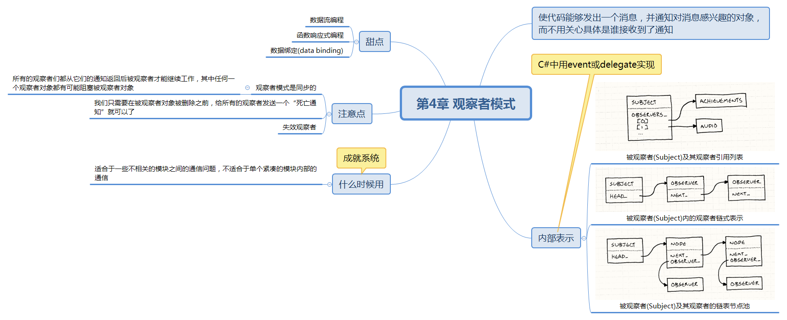

### 第五章 原型模式
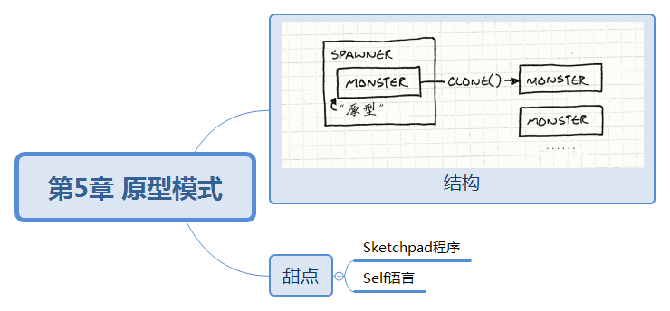

### 第六章 单例模式
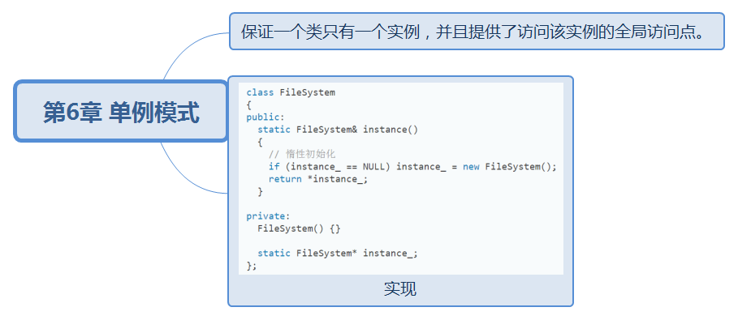

### 第七章 状态模式
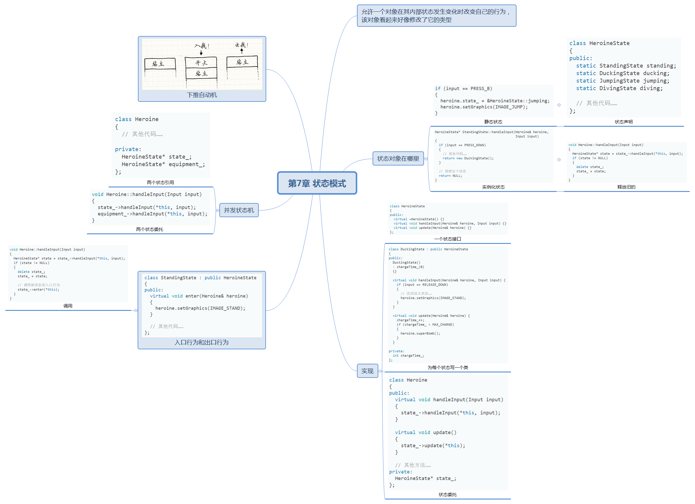

## 第3篇 序列型模式

### 第八章 双缓冲
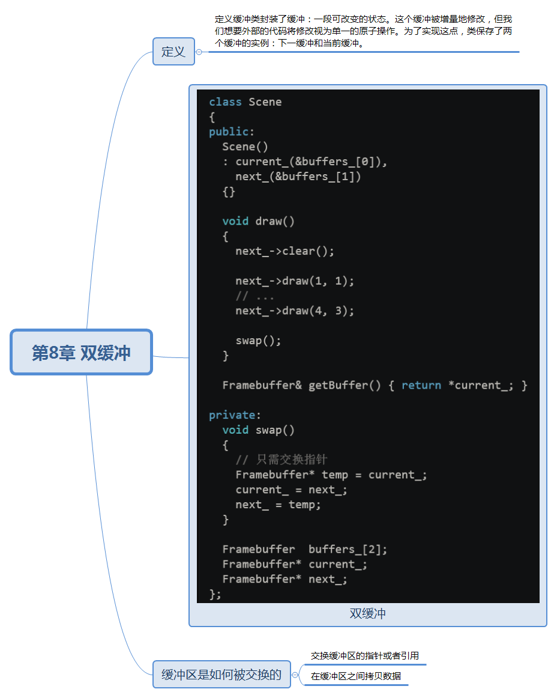

### 第九章 游戏循环
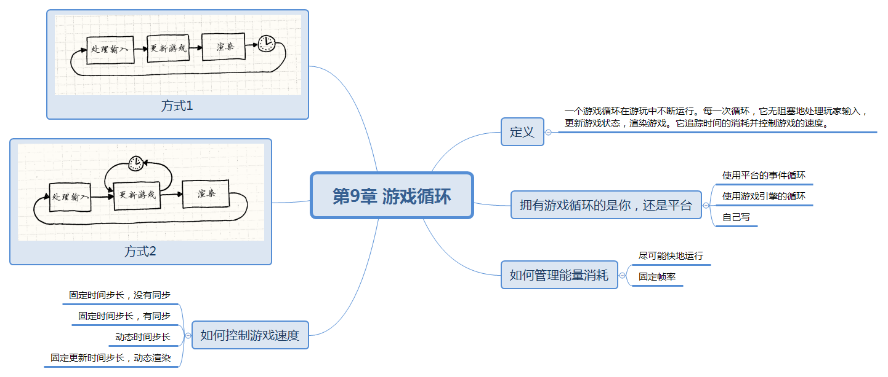

### 第十章 更新方法
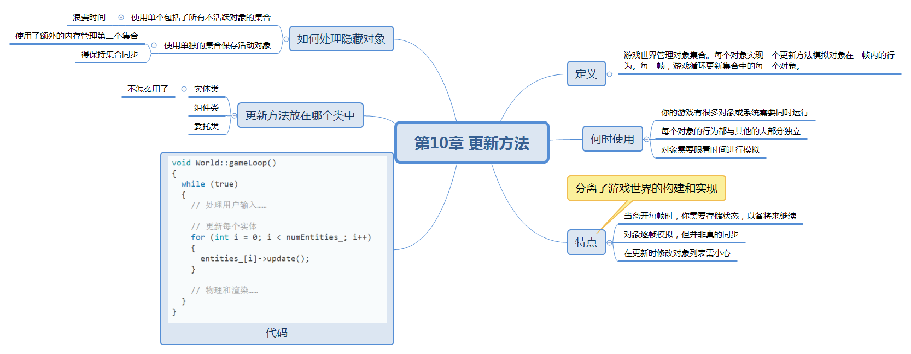

## 第4篇 行为型模式

### 第十一章 字节码
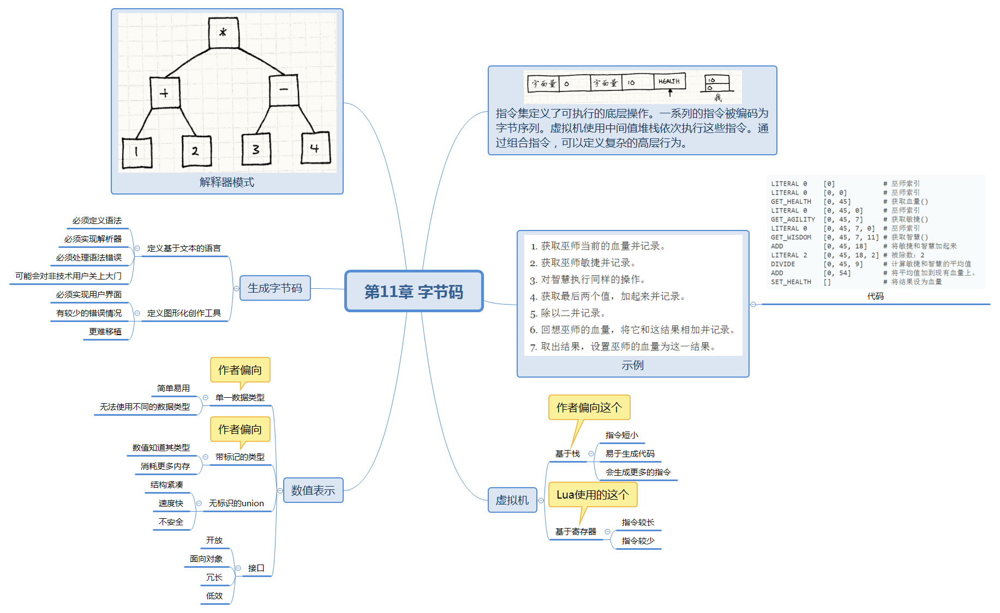

### 第十二章 子类沙盒
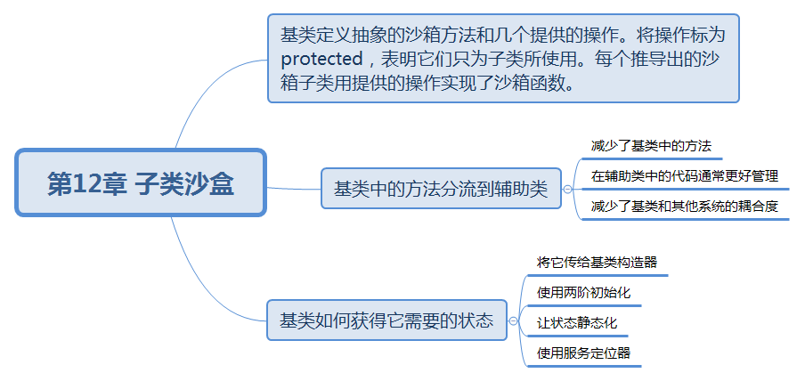

### 第十三章 类型对象
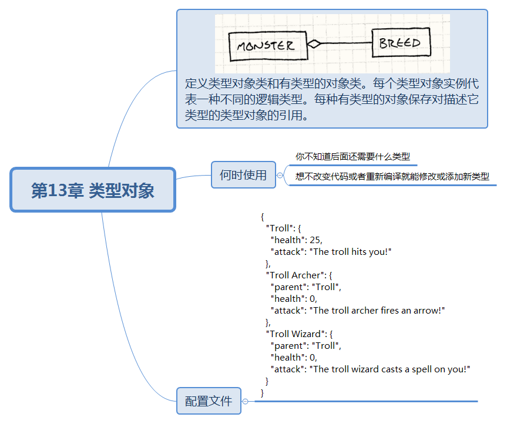

## 第5篇 解耦型模式

### 第十四章 组件模式
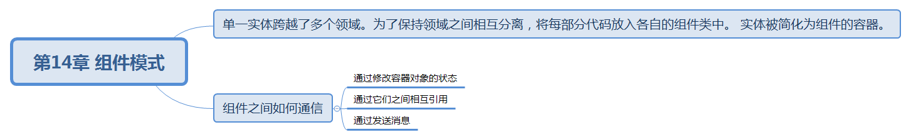

### 第十五章 事件队列
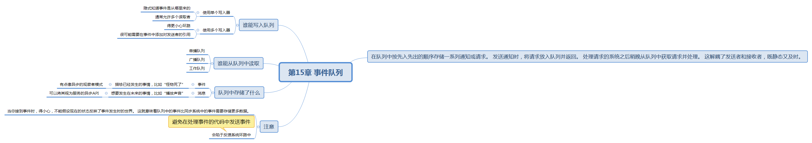

### 第十六章 服务定位器
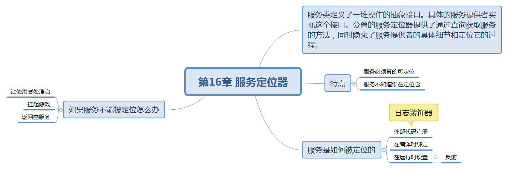

## 第6篇 优化型模式

### 第十七章 数据局部性
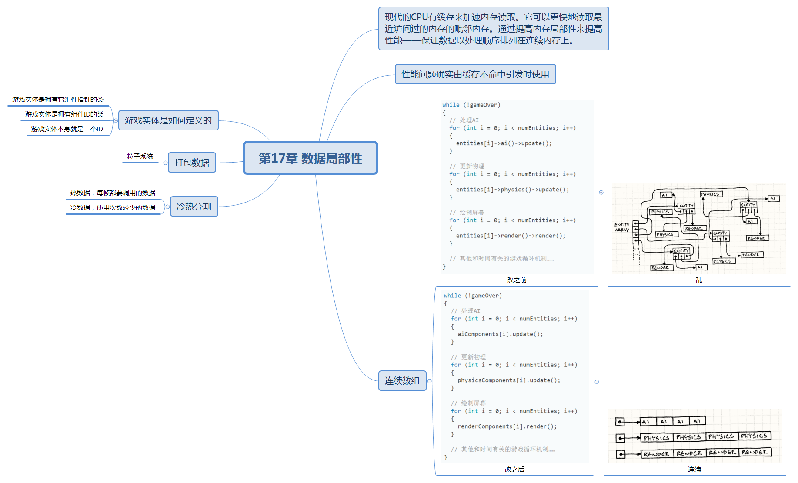

### 第十八章 脏标识模式
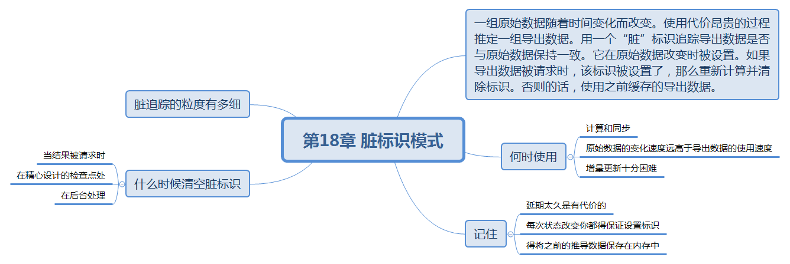

### 第十九章 对象池模式
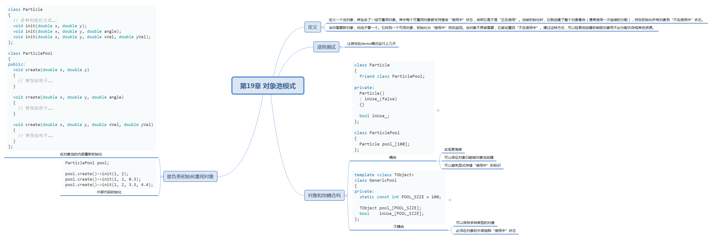

### 第二十章 空间分区
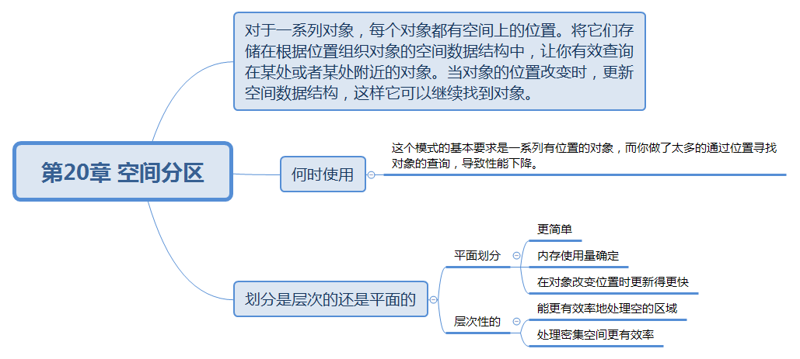